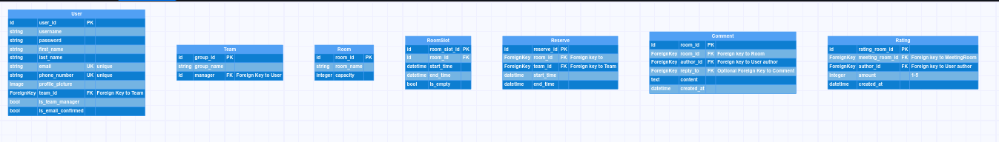

# Room Reservation System

The Room Reservation System is a Django web application designed to facilitate the booking of meeting rooms for various
sessions. Users can conveniently reserve rooms for specific dates and times, manage their reservations, and interact
with the system through an intuitive interface.
Features

- User Authentication: Users can create accounts, log in, and log out securely.
- View Available Rooms: Users can browse through a list of available meeting rooms.
- Reserve Room: Users can book a meeting room for a particular date and time slot.
- Manage Reservations: Users have the ability to view and cancel their existing reservations easily.

## Setup

To run the Meeting Room Reservation System locally, follow these steps:

1. Clone the repository:
```bash
git clone https://gitlab.com/group4-django-fall1/room-reservation.git
```

2.Navigate to the project directory:
```bash
cd  room_reservation
```
3.Install dependencies:

  ```bash
  pip install -r requirements.txt
  ```

4.Apply database migrations:

  ```bash
  python manage.py migrate
  ```

5.Create a superuser:

```bash
python manage.py createsuperuser
```

6.Run the development server:

```bash
python manage.py runserver
```

The application will be accessible at `http://localhost:8000.`

7.Configure local settings:

- Navigate to the config directory.
- Create a local_settings.py file.

## Usage

Follow these steps to utilize the Room Reservation System:

1. Navigate to the application URL in your web browser.
2. Register for a new account or log in with existing credentials.
3. Enter your code
4. Explore the list of available meeting rooms.
5. Go to reserve for reservation and select room,date, and time for your reservation.
6. Confirm your reservation.
7. To cancel a reservation, go to your reservation page and select the reservation to cancel.
8. By clicking on a room, you can view comments and ratings left by others, helping you make informed decisions.
9. Easily manage your profile by updating information and accessing it with a simple click on "Profile."

## Admin Interface

The admin interface is accessible at http://localhost:8000/admin. You can log in using the superuser account created
during setup. Through the admin interface, you can manage users, meeting rooms, and reservations efficiently.

## Technologies Used

- Django
- HTML/CSS
- JavaScript (optional, for frontend interactivity)
- SQLite 


## Running Tests

To execute the tests for the project, run the following command:

```bash
py manage.py test
```

## Contributors

- Sahar Haghighat
- Ali Mohammad Zadeh
- Maryam Naaseri
- Sepehr Azami

## Mentor

- Mohammad Mehdi Ahmadi

## ERD




Feel free to reach out for any further assistance or contributions!

Note: This READ ME file is intended for the GitLab repository. Please make sure to update it accordingly.

